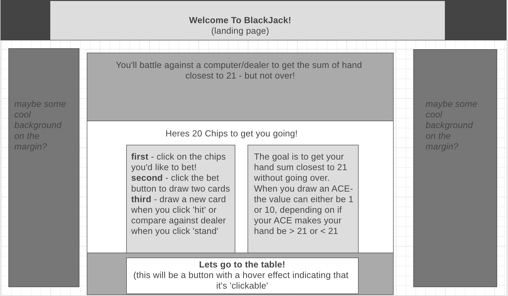
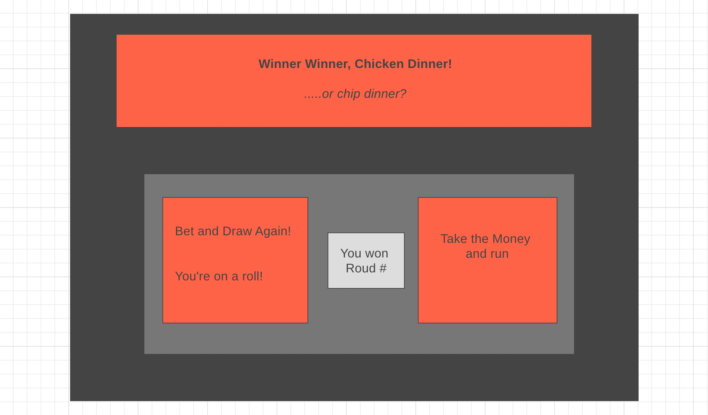
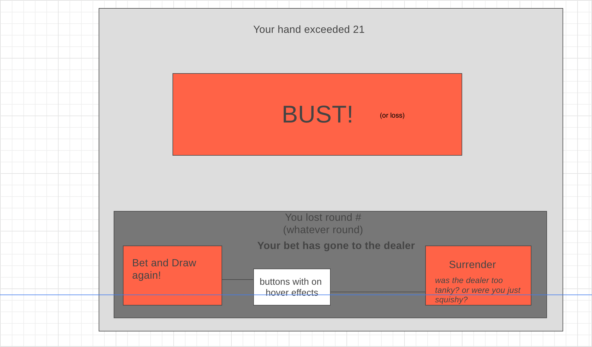

# <a href='https://infinitelyann.github.io/Project-1/'>Check Out My game!</a>
- # !!!!!DISCLAIMER - <a href="https://www.deckofcardsapi.com/">Deck of Cards API</a> sometimes crashes- resulting in my game not running. If you try it and it's not working, try again in a few hours!

# BlackJack Overview

Basic Game of 21

# Technologies Used

-HTML

-CSS

-Javascript

<a href='https://deckofcardsapi.com/api/deck/new/'>-API</a>

# Player Stories

-the player will have a starting amount of $$

-player will then place a bet with the click of a button, after choosing their bet amount with the click of buttons respective to their chips(four different colored chips with four different values)(this will basically be a start button)

-this will draw two random cards from a deck of cards array

-the dealer will then draw two cards

-after the initial drawing of cards, the player will have the options to, when clicked:

1-"hit":draw a new card---that will automatically add that cards 'i' number value to the sum of the players hand, and display "bust" if sum is > 21, and will restart the game, giving dealer the players bet.

2- "stand": decide to let their current sum of hand compare to the dealers sum of hand (both of which will be empty arrays, filled with the .push() method upon draw. whoevers sum is <= 21 and > the others hand, will win the chips on the table.

-upon player wins/losses, the value of the respective variable will be increased by 1, and the respective page will display with options to Quit, or Go again. Bust will be considered a loss

-when the player wins, the sum of the chips they win will be organized into their respective chip color, automatically upgrading chip color if it's value allows

-the game will continue in rounds until the player runs out of chips, or the deck is empty, whichever happens first

# Deck

-starting out as an empty array

-the array will be filled on a shuffle function, containing Math.random(Math.floor) methods

-ALL cards that are drawn will be passed into a for-loop, that will indicate the "i" value of that card

-this "i"(index) value will reflect the number value of the card(that will be used to calculate the sum of the hand, including a conditional for ACE being 1 or 10) and which of the four suits the card belongs

-the deck of cards array will be associated with an API, therefore this will be an array of objects

-when the player starts the game, the two cards drawn will also be determined with Math.random, and will be removed from the array will be removed from the deck with the .pop() method

-the dealer will also automatically draw two cards, which will be removed from the deck with a similar function to player turn

# WireFrames

# E-R-D

  

# Schedule for Project Week

My plan of execution

# My backup-idea is SNAKE
